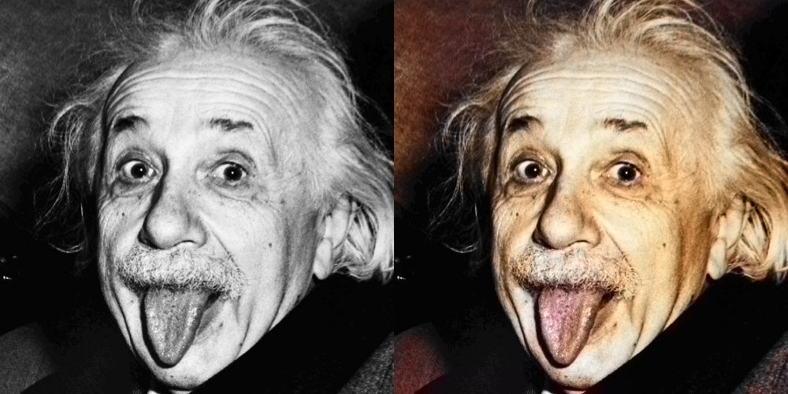

# 🎨 AI Photo Colorization & Restoration


## 📖 Project Overview
This project utilizes **Deep Learning** to automatically colorize black & white (grayscale) images. It uses a Caffe model trained on millions of images to predict the **Lab color space** channels ('a' and 'b') based on the input lightness ('L').

It is perfect for restoring historical photos or bringing old family memories back to life.

### 🖼️ Before & After

*(Original Grayscale Input vs. AI Colorized Output)*

---

## 🛠️ How It Works
1.  **Input:** Takes a grayscale image (L channel).
2.  **Processing:** The CNN model predicts the missing 'a' (Green-Red) and 'b' (Blue-Yellow) color channels.
3.  **Output:** Merges L + a + b channels and converts them back to RGB.

---

## 🚀 How to Run

### 1. Clone the Repository
```bash
git clone [https://github.com/han5858/AI-Photo-Colorization.git](https://github.com/han5858/AI-Photo-Colorization.git)
cd AI-Photo-Colorization
